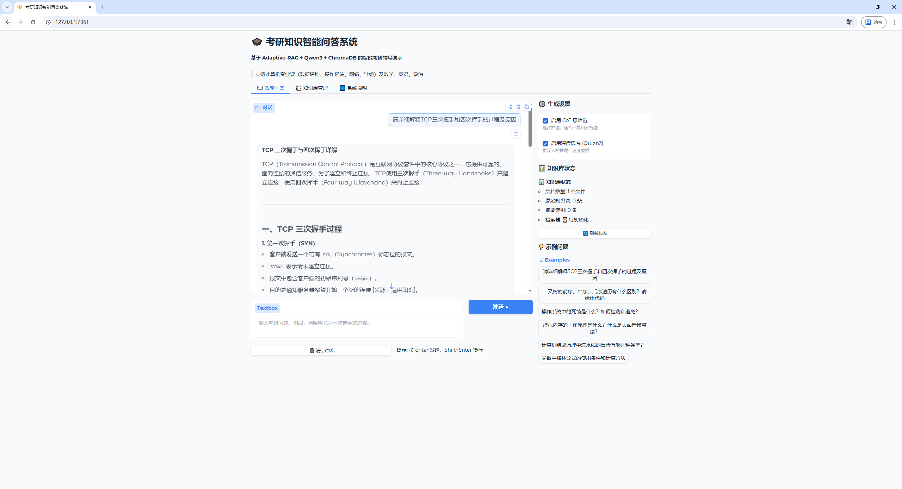
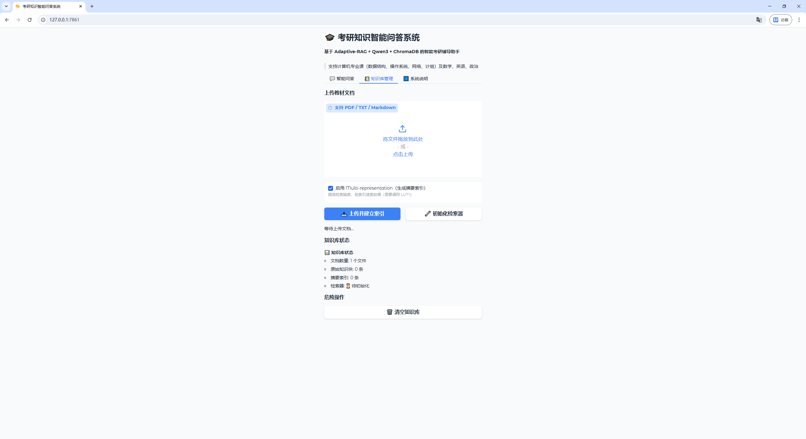
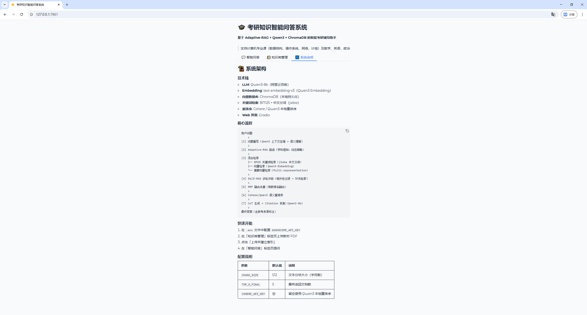

# 考研知识智能问答系统

基于 **Adaptive-RAG + Qwen3 + ChromaDB** 的智能考研辅导助手，支持本地化部署。

整合考研知识库（PDF/TXT/Markdown 教材），结合大语言模型（LLM）与检索增强生成（RAG）技术，在提升索引关键知识效率与准确性的同时减少幻觉，助力考研学生高效复习。

## 功能特性

- **混合检索**：BM25 关键词检索 + Qwen3-Embedding-8b 向量检索 + 摘要向量检索（Multi-representation）
- **学科感知路由**：Adaptive-RAG 自动识别题目所属学科（数据结构 / 操作系统 / 计算机网络 / 组成原理 / 数学 / 英语 / 政治），动态调整检索策略
- **问题重写**：Qwen3-8b 对模糊/口语化问题进行语义理解与结构化重写，并拆分子问题多角度检索
- **Self-RAG 过滤**：多轮相关性评估，自动判断是否需要补充检索
- **RRF 融合 + Cohere 重排序**：Reciprocal Rank Fusion 去重融合，Cohere rerank-multilingual-v3.0 语义重排序（无 Cohere Key 自动降级到 Qwen3 本地重排序）
- **CoT 推理 + Citation 机制**：思维链逐步推导，关键结论标注 `[来源N]` 可追溯验证
- **流式输出**：打字机效果实时展示回答过程
- **Web 界面**：Gradio 可视化界面，支持文档上传、索引管理、多轮对话

## 技术栈

| 模块 | 技术 |
|------|------|
| LLM | Qwen3-8b（阿里云百炼 API）|
| Embedding | Qwen3-Embedding-8b（阿里云百炼 API）|
| 向量数据库 | ChromaDB（本地持久化）|
| 关键词检索 | BM25 + jieba 中文分词 |
| 重排序 | Cohere rerank-multilingual-v3.0 / Qwen3 本地降级 |
| Web 框架 | Gradio |
| 追踪监控 | LangSmith（可选）|

## 系统架构

```
用户问题
    ↓
[1] 问题重写（Qwen3 上下文压缩 + 语义理解 + 子问题拆分）
    ↓
[2] Adaptive-RAG 路由（学科感知，动态调整检索策略）
    ↓
[3] 混合检索
    ├── BM25 关键词检索（jieba 中文分词）
    ├── 向量检索（Qwen3-Embedding-8b）
    └── 摘要向量检索（Multi-representation）
    ↓
[4] Self-RAG 多轮评估（相关性过滤 + 判断是否补充检索）
    ↓
[5] RRF 融合去重（Reciprocal Rank Fusion）
    ↓
[6] Cohere / Qwen3 语义重排序
    ↓
[7] CoT 生成 + Citation 机制（Qwen3-8b）
    ↓
最终答案（含参考来源标注）
```
## 呈现效果



## 快速开始

### 1. 克隆项目

```bash
git clone https://github.com/your-username/kaoyan_rag.git
cd kaoyan_rag
```

### 2. 安装依赖

```bash
pip install -r requirements.txt
```

或使用启动脚本自动安装：

```bash
python run.py --install
```

### 3. 配置 API Key

复制配置文件模板并填入你的 API Key：

```bash
cp .env.example .env
```

编辑 `.env` 文件：

```env
# 必填：阿里云百炼 API Key（免费注册获取）
DASHSCOPE_API_KEY=sk-xxxxxxxxxxxxxxxx

# 可选：Cohere 重排序（留空自动用 Qwen3 本地重排序）
COHERE_API_KEY=

# 可选：LangSmith 追踪
LANGCHAIN_API_KEY=
LANGCHAIN_TRACING_V2=false
```

> 阿里云百炼 API Key 获取地址：https://bailian.console.aliyun.com/

### 4. 启动系统

```bash
python run.py
```

浏览器访问 http://localhost:7861

### 5. 上传知识库

1. 打开「📚 知识库管理」标签
2. 上传考研教材（支持 PDF / TXT / Markdown）
3. 点击「上传并建立索引」，等待索引完成
4. 切换到「💬 智能问答」开始提问

## 命令行索引工具

除 Web 界面外，也可通过命令行批量建立索引：

```bash
# 索引整个目录
python build_index.py --dir ./data/docs

# 索引单个文件
python build_index.py --file ./data/docs/数据结构.pdf

# 跳过摘要生成（更快，精度略低）
python build_index.py --dir ./data/docs --no-summary

# 查看知识库状态
python build_index.py --stats
```

## 项目结构

```
kaoyan_rag/
├── app.py              # Gradio Web 界面
├── run.py              # 快速启动脚本
├── build_index.py      # 命令行索引工具
├── requirements.txt    # 依赖列表
├── .env.example        # 配置文件模板
├── src/
│   ├── config.py       # 配置管理
│   ├── indexer.py      # 离线索引建立（Embedding + ChromaDB）
│   ├── retriever.py    # 混合检索（BM25 + 向量 + Adaptive-RAG）
│   ├── reranker.py     # 后处理（RRF + Self-RAG + 重排序）
│   ├── generator.py    # 答案生成（CoT + Citation）
│   └── rag_pipeline.py # 主流水线
└── data/
    ├── docs/           # 存放教材文档（需自行添加）
    └── chroma_db/      # ChromaDB 向量数据库（自动生成）
```

## 配置参数

| 参数 | 默认值 | 说明 |
|------|--------|------|
| `CHUNK_SIZE` | 512 | 文本分块大小（字符数）|
| `CHUNK_OVERLAP` | 50 | 分块重叠字符数 |
| `TOP_K_VECTOR` | 10 | 向量检索返回数量 |
| `TOP_K_BM25` | 10 | BM25 检索返回数量 |
| `TOP_K_FINAL` | 5 | 最终传入 LLM 的文档数 |

## 支持的学科

- 计算机专业课：数据结构、操作系统、计算机网络、计算机组成原理
- 公共课：数学、英语、政治

## License

MIT
